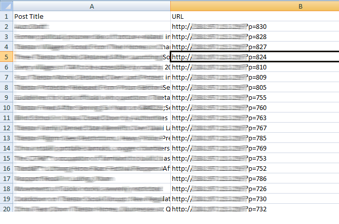
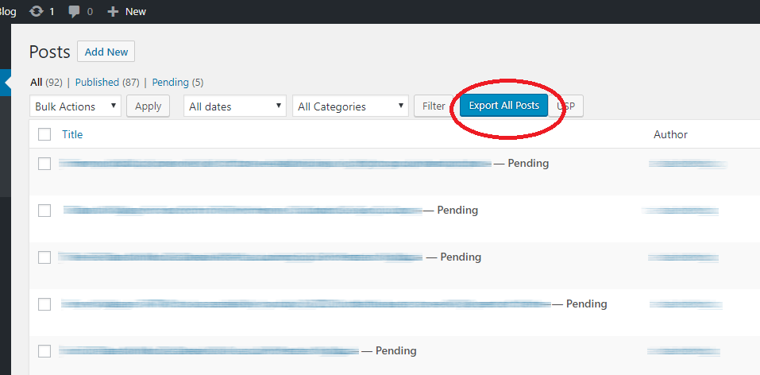

---
title:	Export Post to CSV
description: How to add a custom button on the post listing page and export posts to CSV without using any wordpress Plugins.

pubDate: 'Oct 17 2018'
heroImage: '../../assets/bg.jpg'
category: 'Wordpress Tricks'
tags: ['JavaScript', 'css', 'HTML5', 'Wordpress']

draft: False
---

## introduction
If you are running a WordPress site, then it’s obvious that you have written plenty of posts. WordPress provides a good interface for posts listing. Still, someone wants to export posts to CSV. In this article, we show you how to add a custom button on the post listing page and export posts to CSV without using any wordpress Plugins.

In our case, we export only the post title and post URL in the CSV file. You can include more extra fields like date, categories, tags, and even more meta data.


Using such CSV you can easily find the post title and their permalink. This can be useful to find out related articles of a specific post.

## Add Buttons

To generate the CSV, we first need to give a button on the listing page of a post screen. On the click of this button, we will write a code for generating a CSV.

Open your `functions.php` file and place the below code in it.

```php
add_action( 'restrict_manage_posts', 'add_export_button' );
function add_export_button() {
    $screen = get_current_screen();
 
    if (isset($screen->parent_file) && ('edit.php' == $screen->parent_file)) {
        ?>
        <input type="submit" name="export_all_posts" id="export_all_posts" class="button button-primary" value="Export All Posts">
        <script type="text/javascript">
            jQuery(function($) {
                $('#export_all_posts').insertAfter('#post-query-submit');
            });
        </script>
        <?php
    }
}
```
  
  Above code add the button ‘Export All Posts’ on the posts listing as shown in the screenshot. Here, we have used get_current_screen() method to find out post screen page. We have written a jQuery code to place our button next to the button ‘Filter’.

## Actual Code
At this stage, we are ready with our action which on trigger should generate our CSV. So, let’s add a code which generates the CSV in the background and send to the browser for download.

Add the below code in the `functions.php` file.

```php
add_action( 'init', 'func_export_all_posts' );
function func_export_all_posts() {
    if(isset($_GET['export_all_posts'])) {
        $arg = array(
                'post_type' => 'post',
                'post_status' => 'publish',
                'posts_per_page' => -1,
            );
 
        global $post;
        $arr_post = get_posts($arg);
        if ($arr_post) {
 
            header('Content-type: text/csv');
            header('Content-Disposition: attachment; filename="wp.csv"');
            header('Pragma: no-cache');
            header('Expires: 0');
 
            $file = fopen('php://output', 'w');
 
            fputcsv($file, array('Post Title', 'URL'));
 
            foreach ($arr_post as $post) {
                setup_postdata($post);
                fputcsv($file, array(get_the_title(), get_the_permalink()));
            }
 
            exit();
        }
    }
}
```
You may also want to read our related article on Display Last Updated Date On Post Screen In WordPress.


