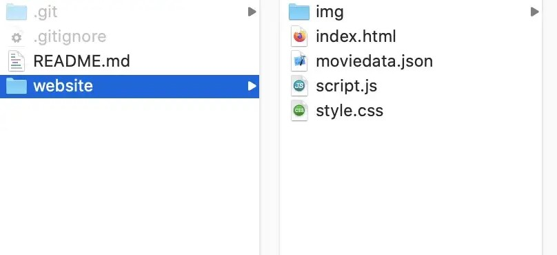

---
date:	2022.12.6
title:	AWS S3 bucket webhosted using Github Action
description: Github Action for deployment of Static-website to AWS S3 Bucket

pubDate: 2022.12.26
heroImage: '../../assets/git-aws.png'
category: 'GitHub'
tags: ['Apache','AWS']
draft: False
---


## Things you would need:
 - A GitHub account
 - An AWS account
 ``Guess you already familiar with github and AWS Cloud Platform``

## Process: 
 1. Create a GitHub repository for your website — 10min
 2. 2 Configure an AWS IAM user — 5min
 3. Configure a GitHub Action — 5min
4. Make a change and Deploy — 5min
Celebrate — 5min (at least !)

## Create a GitHub repository
`*If you already have your repository configured, you can go to Part 2 !`

Here, you want to put your code into a repository that will be used to track the changes and trigger the deployment.

1. Go to GitHub and connect to your account
2. Create a new repository
3. Feel free to fill the parameters to have the repository you want


4. Clone the newly created repository to your local laptop using the Git command line or your favorite UI tool for Git

```
git clone https://github.com/YOUR-USERNAME/YOUR-REPOSITORY

```

You will find the url to use in your repository, clicking on the “Code” button

For more information on the git clone have a look a the [GitHub documentation](https://docs.github.com/en/free-pro-team@latest/github/creating-cloning-and-archiving-repositories/cloning-a-repository).

5. Put your files on the created folder and push it


Now, if you go to https://github.com/<username>/<repositoryname>, you will see your code waiting for you on the main branch!

Fine, let’s have a bit of AWS now!

##  Create an AWS IAM user
Your goal is to push some files to your S3 bucket. For this purpose, you will need to have rights on the S3 bucket.

You will use an IAM user with an S3 policy.
1. Open the AWS console
2. Go to the IAM page
3. Click on “Users” in the menu and add a new user


4. Pick a name and choose the programmatic access


5. You are going to use an existing policy that will give you full control over the S3 service.
(We use this for demonstration simplicity. You can enforce more security by creating your own policy to respect the least privilege principle.)

 6. You can put some tags to identify your user if you need it, otherwise skip the step 3
 7. Review your information and create the user


8. Here you need to keep the Access key ID and the Secret access key somewhere safe. This is the equivalent of your Login-Password.

And that’s it for the AWS IAM part! Easy stuff right?

Let’s go back to GitHub!


## Configure a GitHub Action
You will use a ***GitHub Action*** to deploy your files into the S3 bucket.
To make GitHub able to use our AWS user rights, you need to configure the user credentials you just created.

1. Go to the Setting section of your repository menu and click on Secrets


2. Create two new secrets and put the values you kept from the IAM User creation.
```
AWS_ACCESS_KEY_ID
AWS_SECRET_ACCESS_KEY
```

Now that you have our credentials ready, let’s create the workflow itself.

All the steps in your workflow should be created in the .github/workflow/ folder. GitHub Action will monitor this folder to find what to execute.

3. Let’s create a .github/workflow/main.yml

```
mkdir .github/workflow
touch .github/workflow/main.yml
```
And add the following code to your main.yml file:

```yml
name: CI
on: 
  push:
    branches:
      - main #here we choose to deploy only when a push is detected on the main branch
jobs:
  build:
    runs-on: ubuntu-latest
    steps:
    - uses: actions/checkout@v1
    - name: Configure AWS Credentials
      uses: aws-actions/configure-aws-credentials@v1
      with:
        aws-access-key-id: ${{ secrets.AWS_ACCESS_KEY_ID }}
        aws-secret-access-key: ${{ secrets.AWS_SECRET_ACCESS_KEY }}
        aws-region: us-east-1 # Use your bucket region here
        
    # Here you could add some building steps if you were dealing with some angular/react/Vue...
    # - name: Build static site
    #  run: yarn install && npm run-script build
    
    - name: Deploy static site to S3 bucket
      run: aws s3 sync ./thefoldertodeploy/ s3://<<your-s3-bucket-name>> --delete
      # --delete flag will remove any file in the s3 that are not on the "<<your-s3-bucket-name>>" folder
```

Here you are creating an Action to execute some steps every time a push happens on the main branch. You run your Action on an ubuntu (Linux) machine and you have a dependency on [one of the already created AWS GitHub Actions](https://github.com/aws-actions).

It configures your credentials as well as the region. It should correspond to the one in which you created your S3 bucket.

Then you can see the Action steps.

As you are pushing a simple HTML/CSS folder, you have no build step but you could add some steps here. Maybe generate some build artifacts into a folder and push this folder to the S3 bucket.

You use the AWS s3 sync command to synchronize the folder “thefoldertodeploy” with the content of the S3 bucket.

Now you can push this to the main branch.

## Make a change and Deploy
Now that your Action is configured, change a little thing visible on your website and push this change to the main branch.
Then go to the Actions section of your GitHub repository and observe the steps being executed!


[/If you want to know more about GitHub Actions, here is a link to spend some time on it!](https://github.com/features/actions)


Congrats! You have just found a way to focus on what really matters: the content!

GitHub Actions is a really good way to implement a simple pipeline for your static website. You can get ready to push modification within minutes and you will never be responsible for your deployments anymore.

From there, you can do a little exploration session on GitHub actions or just add this topic to your Wish list!